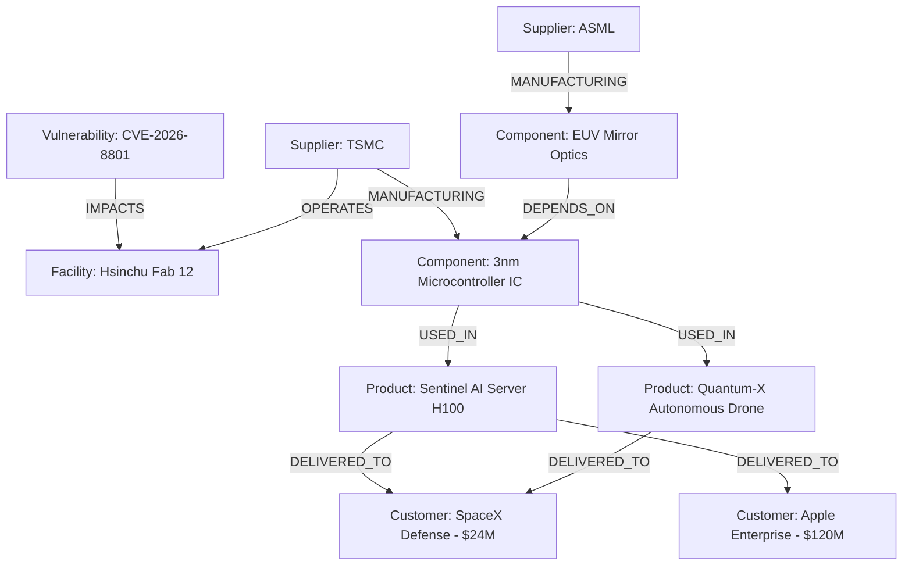

# NexusGraph - Enterprise Supply Chain and Vulnerability Blast Radius Engine

Wexa AI - Take-Home Assignment: Graph Database Application  
Backed by CognoDB Cloud (openCypher over Bolt protocol using official Neo4j Driver)

NexusGraph is a full-stack graph database application built to solve supply chain vulnerability and multi-hop risk blast radius analysis. In modern global supply networks and complex software architectures, disruptions like material shortages, hardware defects, or vendor vulnerabilities ripple transitively across multi-tier dependency chains. 

NexusGraph leverages CognoDB Cloud to perform sub-millisecond multi-hop openCypher traversals, identifying affected downstream products, calculating total financial revenue exposed across enterprise customer contracts, and discovering structural single-point-of-failure bottlenecks.

---

## Why a Graph Database? (Relational SQL vs. CognoDB openCypher)

Supply networks and software dependency chains are fundamentally networks rather than flat tables. Answering critical operational questions such as "Which enterprise customers or production applications are exposed if a cleanroom fab or open-source component fails?" requires traversing variable-length relationships:

Vulnerability -> Facility -> Supplier -> Sub-Component -> Product Model -> Enterprise Customer

### Architectural Comparison Table

| Feature Dimension | Relational RDBMS (PostgreSQL / MySQL) | CognoDB Cloud (openCypher) |
| :--- | :--- | :--- |
| Data Representation | Split across multiple tables with foreign key join tables (suppliers, facilities, components, join tables). | Labeled Nodes and First-Class Typed Relationships directly linked via index-free adjacency pointers. |
| Multi-Hop Traversal | Requires complex WITH RECURSIVE Common Table Expressions (CTEs) or multiple nested JOIN queries. | Native variable-length Cypher pattern matching: MATCH path = (v)-[*1..5]->(target). |
| Query Performance | Degrades exponentially as hop depth increases due to repeated full table scans on join tables. | Constant per-step lookup time following direct physical memory pointers. |
| Path Finding Algorithms | Requires custom recursive procedures or external graph calculation engines for shortest path queries. | Built-in native openCypher shortestPath() function executed directly within the database engine. |
| Schema Evolution | Requires heavy DDL migrations (ALTER TABLE) when introducing new dependency relationship types. | Dynamic node property and relationship type creation without downtime or schema locks. |

---

## Graph Data Model Schema

NexusGraph supports both software supply chain networks and physical supply chain networks.

### Labeled Nodes and Properties

- Vulnerability: id, name, cve, severity (CRITICAL, HIGH, MEDIUM), riskScore, type
- Library / Component: id, name, partNumber, category, unitCost, status
- Service / Facility: id, name, city, status
- Application / Product: id, name, sku, price, category
- Vendor / Supplier: id, name, country, tier, status, reliabilityScore
- Infrastructure / Customer: id, name, sector, annualContractValue

### Typed Relationships

- (:Vulnerability)-[:HAS_VULNERABILITY]->(:Service | :Library)
- (:Application)-[:COMPOSED_OF]->(:Service)
- (:Service)-[:DEPENDS_ON]->(:Library)
- (:Library)-[:MAINTAINED_BY]->(:Vendor)
- (:Service)-[:DEPLOYED_ON]->(:Infrastructure)
- (:Vulnerability)-[:IMPACTS]->(:Facility)
- (:Supplier)-[:MANUFACTURING]->(:Component)
- (:Component)-[:USED_IN]->(:Product)
- (:Product)-[:DELIVERED_TO]->(:Customer)

### Data Model Diagram



---

## Main Cypher Queries Explained

All Cypher queries in NexusGraph are strictly parameterised using the official Neo4j JavaScript driver parameter binding ($param placeholders) to prevent Cypher injection and allow database query plan optimization.

### 1. Multi-Hop Blast Radius Traversal (1 to 5 Hops)
Calculates all downstream customer revenue exposed to a specific vulnerability disruption across 1 to 5 relationship hops.

```cypher
MATCH path = (v:Vulnerability {id: $startNodeId})-[r:IMPACTS|THREATENS|OPERATES|MANUFACTURING|DEPENDS_ON|USED_IN|DELIVERED_TO*1..5]->(c:Customer)
WITH path, nodes(path) AS pathNodes, relationships(path) AS pathRels, c
UNWIND pathNodes AS n
UNWIND pathRels AS rel
RETURN DISTINCT n, rel, sum(c.annualContractValue) AS totalFinancialRisk
```

### 2. Single Point of Failure (Chokepoint Discovery)
Identifies components supplied exclusively by one vendor that power multiple high-value product lines with no configured alternative supplier.

```cypher
MATCH (s:Supplier)-[:MANUFACTURING]->(c:Component)-[:USED_IN*1..3]->(p:Product)
WITH s, c, count(DISTINCT p) AS dependentProductsCount, collect(DISTINCT p.name) AS productNames
WHERE dependentProductsCount >= 2 AND NOT (c)<-[:MANUFACTURING]-(:Supplier WHERE s.id <> id)
MATCH (p:Product)-[:DELIVERED_TO]->(cust:Customer) WHERE p.name IN productNames
RETURN s AS supplier, c AS component, dependentProductsCount, productNames, sum(cust.annualContractValue) AS atRiskValue
```

### 3. Shortest Unaffected Procurement Path
Calculates the shortest valid procurement route from an alternative supplier to an enterprise customer while avoiding any disrupted nodes.

```cypher
MATCH (start:Supplier {id: $startId}), (end:Customer {id: $targetId})
MATCH p = shortestPath((start)-[:MANUFACTURING|DEPENDS_ON|USED_IN|DELIVERED_TO*..6]->(end))
WHERE NONE(node IN nodes(p) WHERE node.status = 'DISRUPTED')
RETURN p
```

---

## Project Structure and Architecture

```
Wexa AI/
├── .env                                # Environment variables (ignored by Git)
├── .env.example                        # Environment variable template
├── NexusGraph.postman_collection.json  # Postman API Collection for testing
├── package.json                        # Root monorepo configuration and scripts
├── README.md                           # Documentation and setup guide
├── scripts/
│   ├── seed.js                         # Idempotent CognoDB openCypher UNWIND seed script
│   ├── testApi.js                      # REST API verification script
│   ├── testConnect.js                  # Database connectivity diagnostic script
│   └── testQueryConsole.js             # Cypher console runner test script
├── server/
│   ├── index.js                        # Express REST API server entry point (Port 5000)
│   ├── db/
│   │   ├── neo4j.js                    # Official Neo4j driver lifecycle and fallback manager
│   │   └── mockData.js                 # Baseline mock dataset and in-memory graph engine
│   ├── queries/
│   │   └── cypherQueries.js            # Parameterised Cypher query library
│   └── routes/
│       ├── graph.js                    # REST endpoints for graph operations
│       └── health.js                   # CognoDB connectivity health check endpoint
└── client/                             # Vite + React frontend application (Port 3000)
    ├── index.html                      # HTML entry point
    ├── package.json                    # Client dependencies
    ├── vite.config.js                  # Vite configuration with API proxy to port 5000
    └── src/
        ├── App.jsx                     # Main React application component
        ├── main.jsx                    # React DOM render entry point
        ├── index.css                   # Global dark theme and typography styles
        └── components/
            ├── Navbar.jsx              # Navigation header and tab switcher
            ├── ConnectionBanner.jsx    # CognoDB connection status and setup helper
            ├── GraphVisualizer.jsx     # Interactive vis-network canvas component
            ├── BlastRadiusTool.jsx     # Multi-hop blast radius simulator panel
            ├── BottleneckFinder.jsx    # Single point of failure chokepoint finder
            ├── QueryConsole.jsx        # Parameterised Cypher query execution console
            └── WhyGraphModal.jsx       # SQL vs Graph comparative explainer modal
```

---

## REST API Endpoints Overview

The backend operates as a pure REST API server on port 5000:

- GET http://localhost:5000/ : Returns API service metadata, active port, and available endpoints.
- GET http://localhost:5000/api/health : Returns CognoDB connection status, host URI, and fallback state.
- GET http://localhost:5000/api/graph/full : Returns all nodes, relationships, and summary metrics.
- POST http://localhost:5000/api/graph/blast-radius : Accepts JSON payload {"startNodeId": "VULN-001", "maxHops": 5} and returns multi-hop blast radius risk calculation.
- GET http://localhost:5000/api/graph/bottlenecks : Returns single-point-of-failure suppliers and components.
- POST http://localhost:5000/api/graph/query : Accepts JSON payload {"cypher": "...", "params": {...}} and returns structured query result records.

---

## Step-by-Step Guide to Setup and Run from Start to End

Follow these step-by-step instructions to set up, configure, seed, and run NexusGraph on your local machine.

### Prerequisites

Ensure you have the following software installed on your machine:
- Node.js version 18.0.0 or higher
- npm (Node Package Manager)
- Git
- A free account on CognoDB Cloud (https://console.cognodb.com)

---

### Step 1: Clone the Repository

Open your terminal or command prompt and run:

```bash
git clone <your-repository-url>
cd Wexa-AI
```

---

### Step 2: Install Project Dependencies

Install dependencies for both the root project (backend) and the client (frontend):

```bash
# Install root backend dependencies
npm install

# Install frontend client dependencies
npm install --prefix client
```

---

### Step 3: Set Up CognoDB Cloud Database Instance

1. Go to https://console.cognodb.com/signup and sign up for a free account.
2. From the console dashboard, click Create Instance.
3. Select the free (c0) tier and choose your region. The instance will provision in under a minute.
4. Go to the Connect tab for your instance.
5. Copy your Connection URI (for example: bolt+s://db-1dd427e3.databases.cognodb.com).
6. Click the Copy icon next to the Password field to copy your generated database password.

---

### Step 4: Configure Environment Variables

Create a file named `.env` in the root project directory (`c:\Users\HP\Desktop\Wexa AI\.env`) and add your connection details:

```env
COGNO_DB_URI=bolt+s://db-1dd427e3.databases.cognodb.com
COGNO_DB_USER=cognodb
COGNO_DB_PASSWORD=your_copied_password_here

PORT=5000
NODE_ENV=development
```

Note: Do not commit `.env` to version control. A template is provided in `.env.example`.

---

### Step 5: Seed Data into CognoDB Database

Run the automated seed script to populate your CognoDB database with realistic supply chain nodes and relationships:

```bash
npm run seed
```

Expected terminal output:

```text
Connecting to CognoDB Cloud at bolt+s://db-1dd427e3.databases.cognodb.com...
Verified CognoDB server connection (CognoDB/0.9.11)
Clearing existing graph data...
Seeding labeled nodes with parameterised UNWIND batching...
Seeding typed relationships...
CognoDB Seeding Complete! Total Nodes: 25 | Total Relationships: 24
```

---

### Step 6: Run the Full Application

Start both the backend API server (port 5000) and the frontend client (port 3000) concurrently with a single command:

```bash
npm run dev
```

Terminal output:

```text
NexusGraph REST API Backend running on http://localhost:5000
Web Application UI active on http://localhost:3000
VITE v8.2.2 ready in 733 ms
```

Open your web browser and navigate to:
http://localhost:3000

---

### Step 7: Testing API Endpoints with Postman (Optional)

A ready-to-use Postman Collection file (`NexusGraph.postman_collection.json`) is included in the project root:

1. Open Postman.
2. Click Import.
3. Select `NexusGraph.postman_collection.json`.
4. Execute any of the 6 pre-configured API requests against http://localhost:5000.

---

## Graceful Error Handling and Resilient Fallback Mode

If CognoDB Cloud is temporarily unreachable or if environment credentials are not yet configured:
1. The backend server automatically activates Demo / Fallback Mode.
2. An in-memory graph traversal engine handles all REST API requests (`/api/graph/full`, `/api/graph/blast-radius`, `/api/graph/bottlenecks`, `/api/graph/query`).
3. The web application interface remains 100% functional and interactive, displaying an informative status banner with setup instructions.

---

## Submission Details

- Deliverable: GitHub Repository URL
- Email Recipient: hr@wexa.ai
- Email Subject Line: CognoDB Assignment 2 - <Your Name>
- Instance Persistence: The CognoDB instance db-1dd427e3 will remain active for live evaluation.

Developed for the Wexa AI Take-Home Assignment.
